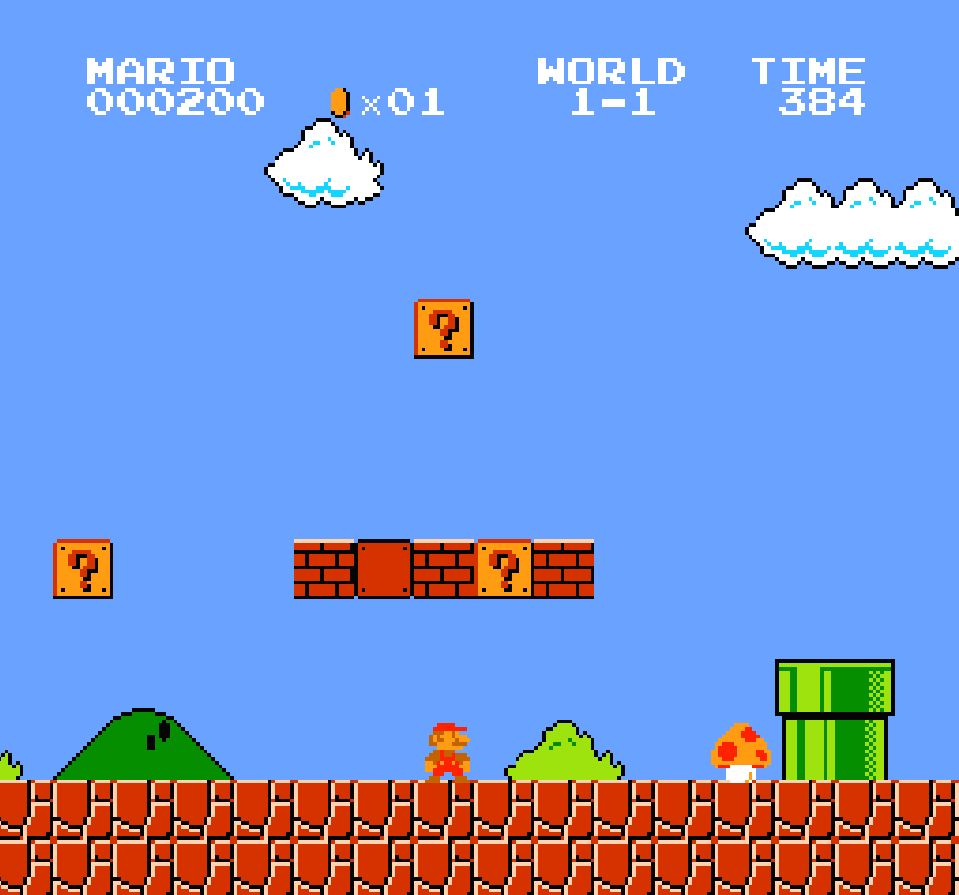

# [RustyNES](https://vedant416.github.io/RustyNES/)

`RustyNES` is a Nintendo Entertainment System (NES) emulator written in Rust.

Written from scratch in `Rust` `without using any external libraries.`

`Cross-platform` and can run on Linux, Windows, and in a web browser (using `WebAssembly`).

Runs using very low cpu and memory resources at `stable 60fps`.

Supports all 5 channels of `NES audio`.

Supports `save state` and `load state`, so that we can resume the game from where we left.

Can run classic NES games like `Super Mario Bros`, `Super Mario Bros 2`, `Super Mario Bros 3`, `Contra` and many more.

---

Try on your local machine by downloading the executable from the [releases](https://github.com/vedant416/RustyNES/releases/tag/v1.0)

Try online in your browser: [RustyNES](https://vedant416.github.io/RustyNES/)
(Under development).

## Screenshots

### Super Mario Bros.

 

## Project Structure

- `RustyNES_core`: This is the heart of the emulator, containing the core emulation logic.

- `RustyNES_cli`: This is a command-line interface that uses `RustyNES_core` and `SDL2` for rendering output, outputting audio, and handling input.

- `RustyNES_wasm`: This crate compiles `RustyNES_core` to WebAssembly which is used by the `RustyNES_web_ui`.

- `RustyNES_web_ui`: This is a web interface that uses `RustyNES_wasm` to run the emulator in a web browser.

## Project Statistics

| Language   | Files  | Lines    | Code     | Comments | Blanks  |
| ---------- | ------ | -------- | -------- | -------- | ------- |
| Rust       | 36     | 4403     | 3505     | 329      | 569     |
| TypeScript | 2      | 436      | 351      | 25       | 60      |
| CSS        | 1      | 351      | 289      | 11       | 51      |
| HTML       | 1      | 149      | 137      | 0        | 12      |
| **Total**  | **40** | **5339** | **4282** | **365**  | **692** |

---

Generated using the [tokei](https://github.com/XAMPPRocky/tokei)
CLI tool.

Command used to generate the statistics:

```bash
tokei -C -t=Rust,TYPESCRIPT,HTML,CSS -s=lines
```

## Keyboard controls

### NES Controller keybindings

| Emulator Button | Keyboard Key           |
| --------------- | ---------------------- |
| Up              | <kbd>W</kbd>           |
| Left            | <kbd>A</kbd>           |
| Down            | <kbd>S</kbd>           |
| Right           | <kbd>D</kbd>           |
| A               | <kbd>L</kbd>           |
| B               | <kbd>K</kbd>           |
| Start           | <kbd>Enter</kbd>       |
| Select          | <kbd>Right Shift</kbd> |

---

### In most games, the following keybindings are used:

- `A`: Used for jumping.

- `B`: Used for shooting.

- `Start`: Starts the game or pauses it when running.

- `Select`: Selects the next option in the menu.

---

### Extra Features keybindings (Not in the original NES)

| Action              | Key          |
| ------------------- | ------------ |
| Save emulator state | <kbd>N</kbd> |
| Load emulator state | <kbd>M</kbd> |

Emulator state is saved in a `.rustynes_sav` file.

`.rustynes_sav` file can be loaded by passing the path to the file as an argument to the emulator.

```bash
./rusty_nes_cli <path_to_save_file>
```

## Building and Usage

The `RustyNES_core` library crate has zero dependencies, but `RustyNES_cli` uses [SDL2](https://www.libsdl.org/) for rendering and input handling. Ensure that SDL2 is installed on your system for building `RustyNES_cli`.

<details>
<summary><strong>Building for Linux</strong></summary>

1. Build the project in release mode:

   ```bash
   cargo build --release
   ```

   The `rusty_nes_cli` executable will be in the `target/release` directory.

2. Run the executable with the path to the ROM file as an argument:

   ```bash
   ./rusty_nes_cli <path_to_rom_file>
   ```

3. To load a save file (`.rustynes_sav`), pass the path to the save file as an argument:

   ```bash
   ./rusty_nes_cli <path_to_save_file>
   ```

</details>

<details>
<summary><strong>Cross-compiling to Windows</strong></summary>

1. Add the Rust target for Windows:

   ```bash
   rustup target add x86_64-pc-windows-gnu
   ```

2. Install `mingw-w64`:

   ```bash
   sudo apt install mingw-w64
   ```

3. Build the project for Windows:

   ```bash
   cargo build --release --target=x86_64-pc-windows-gnu
   ```

   The `rusty_nes_cli.exe` executable will be in the `target/x86_64-pc-windows-gnu/release` directory, and the `SDL2.dll` file will be in the project root directory.

   For running the emulator on Windows, ensure the `SDL2.dll` file is in the same directory as the executable.

4. Run the executable with the path to the ROM file as an argument:

   ```bash
   rusty_nes_cli.exe <path_to_rom_file>
   ```

5. To load a save file (`.rustynes_sav`), pass the path to the save file as an argument:

   ```bash
   ./rusty_nes_cli <path_to_save_file>
   ```

</details>

<details>
<summary><strong>Building for Web</strong></summary>

1. Install `wasm-pack`:

   ```bash
   cargo install wasm-pack
   ```

2. In the `RustyNES_web_ui` directory, run:

   ```bash
   npm install
   npm run dev
   ```

   This command will build the `RustyNES_wasm` library and output the WebAssembly file and JavaScript bindings to the `RustyNES_web_ui/public/pkg` directory.

</details>

## Mappers Implemented

- Mapper 0 (NROM)
- Mapper 2 (UNROM)
- Mapper 4 (MMC3)

## Resources

### Documentation

- [NES Documentation (PDF)](http://nesdev.com/NESDoc.pdf)
- [Nesdev Wiki](https://www.nesdev.org/wiki/Nesdev_Wiki)
- [6502 CPU Reference 1](https://www.c64os.com/post/?p=39)
- [6502 CPU Reference 2](https://www.masswerk.at/6502/6502_instruction_set.html)
- [NES Rendering Overview](https://austinmorlan.com/posts/nes_rendering_overview/)

### Videos

- [The NES Explained] YouTube playlist by [NesHacker]
- [NES Emulator from Scratch] YouTube playlist by [OneLoneCoder]

[NES Emulator from Scratch]: https://www.youtube.com/playlist?list=PLrOv9FMX8xJHqMvSGB_9G9nZZ_4IgteYf
[The NES Explained]: https://youtube.com/playlist?list=PLgvDB6LWam2VDGPgUAMTEEMk0PUtCJs-n&si=Qoquh5uNFiug1iWz
[OneLoneCoder]: https://www.youtube.com/@javidx9
[NesHacker]: https://www.youtube.com/@NesHacker

### Code

- [zeta0134/rusticnes-sdl](https://github.com/zeta0134/rusticnes-sdl)
- [OneLoneCoder/olcNES](https://github.com/OneLoneCoder/olcNES)
- [marethyu/nesty](https://github.com/marethyu/nesty)
- [takahirox/nes-rust](https://github.com/takahirox/nes-rust)
- [nathsou/nessy](https://github.com/nathsou/nessy)
- [fogleman/nes](https://github.com/fogleman/nes)
- [maxpoletaev/dendy](https://github.com/maxpoletaev/dendy/)
- [scottferg/Fergulator](https://github.com/scottferg/Fergulator/)
- [ltriant/nes](https://github.com/ltriant/nes)
- [spieglt/nestur](https://github.com/spieglt/nestur)
